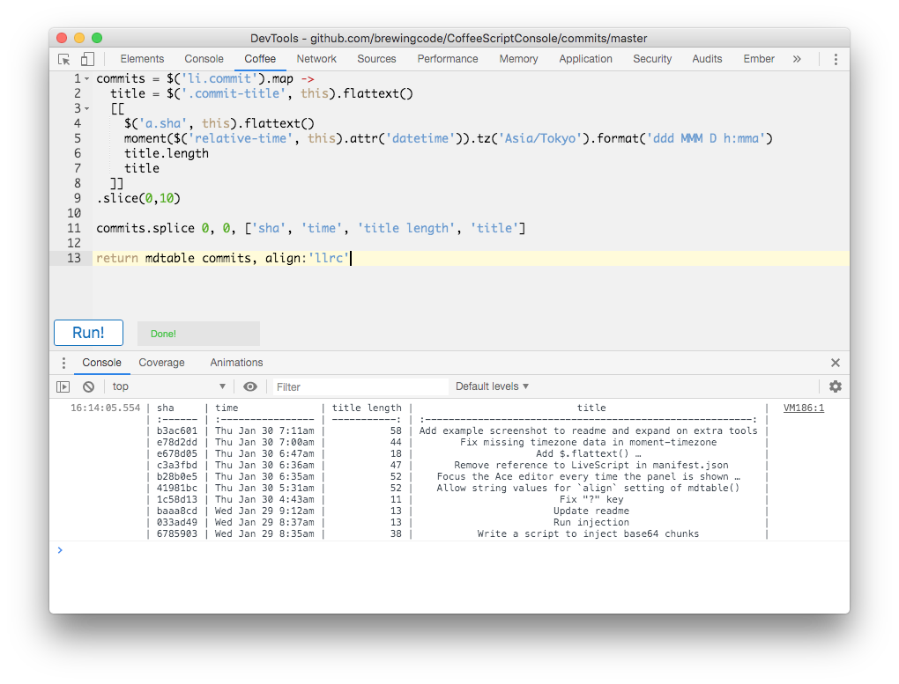
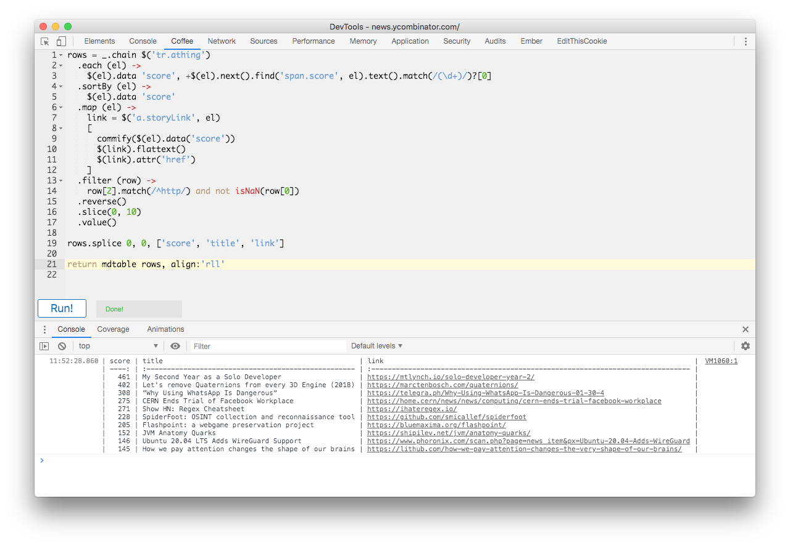

# CoffeeScript Console 3

A Chrome extension to allow writing of
[CoffeeScript](http://coffeescript.org/) within the Web Inspector and run it
within the context of the current window, just like the built-in console.

## Installation

Enable `Developer mode` in the Extensions settings, and load the unpacked
extension from disk.

## Features

  * Syntax highlighting provided via the [ACE editor](http://ace.ajax.org/)
  * [CoffeeScript](http://coffeescript.org/) compilation
  * Command+Enter or Shift+Enter to run the current script
  * Included libraries for convenience:
    - `$` for [jQuery](https://api.jquery.com/)
    - `_` for [lodash](https://lodash.com/docs/4.17.15)
    - `moment` for [moment](https://momentjs.com/docs/), including moment-timezone
    - `Sugar` for [Sugar.js](https://sugarjs.com/quickstart//)
    - `mdtable()` function adapted from [markdown-table](https://github.com/wooorm/markdown-table)
      with a few small additions
  * Helper functions from [custom-helpers.js](./src/custom-helpers.js):
    - `$.flattext()` added to jQuery to flatten whitespace
    - `branch()` and `nodes()` to help crawl around the DOM
    - `commify()` to place commas as thousands separators

## Examples

### Create a Markdown table of github commits

### Show the top 10 posts on HN

## Credits

By [Geza Kovacs](https://github.com/gkovacs)

Based on [LiveScript Console](https://github.com/gkovacs/LiveScriptConsole),
[CoffeeConsole 2](https://github.com/colldo/CoffeeConsole2), and
[CoffeeConsole](https://github.com/snookca/CoffeeConsole)
