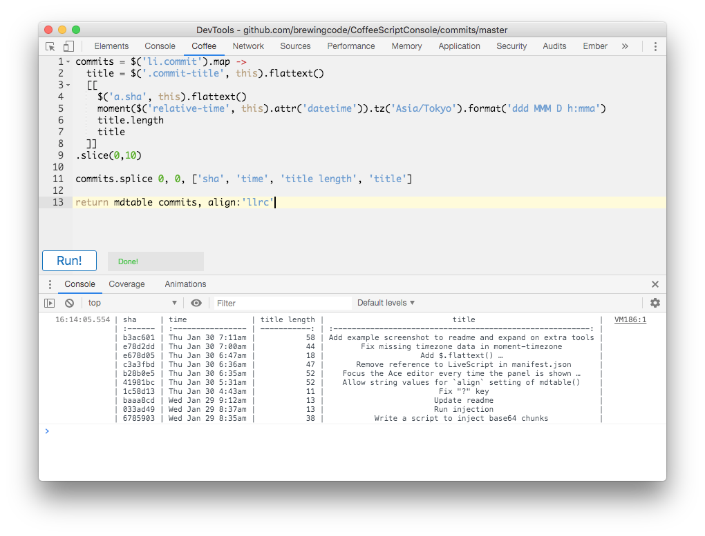

# CoffeeScript Console 3

A Chrome extension to allow writing of
[CoffeeScript](http://coffeescript.org/) within the Web Inspector and run it
within the context of the current window, just like the built-in console.

## Installation

Enable `Developer mode` in the Extensions settings, and load the unpacked
extension from disk.

## Features

  * Syntax highlighting provided via the ACE editor http://ace.ajax.org/
  * CoffeeScript compilation http://coffeescript.org/
  * Command+Enter or Shift+Enter to run the current script
  * Extra libraries and functions for convenience:
    - `$` (jquery)
    - `_` (lodash)
    - `moment` (with moment-timezone support)
    - `mdtable()` to [convert array-of-arrays to Markdown](https://github.com/wooorm/markdown-table)
    - `branch()` to isolate a deep DOM node
    - `node()` to get the result of `branch()` as a list
    - `$.flattext()` to normalize and strip whitespace from `$.text()`

## Credits

By [Geza Kovacs](https://github.com/gkovacs)

Based on [LiveScript Console](https://github.com/gkovacs/LiveScriptConsole),
[CoffeeConsole 2](https://github.com/colldo/CoffeeConsole2), and
[CoffeeConsole](https://github.com/snookca/CoffeeConsole)

