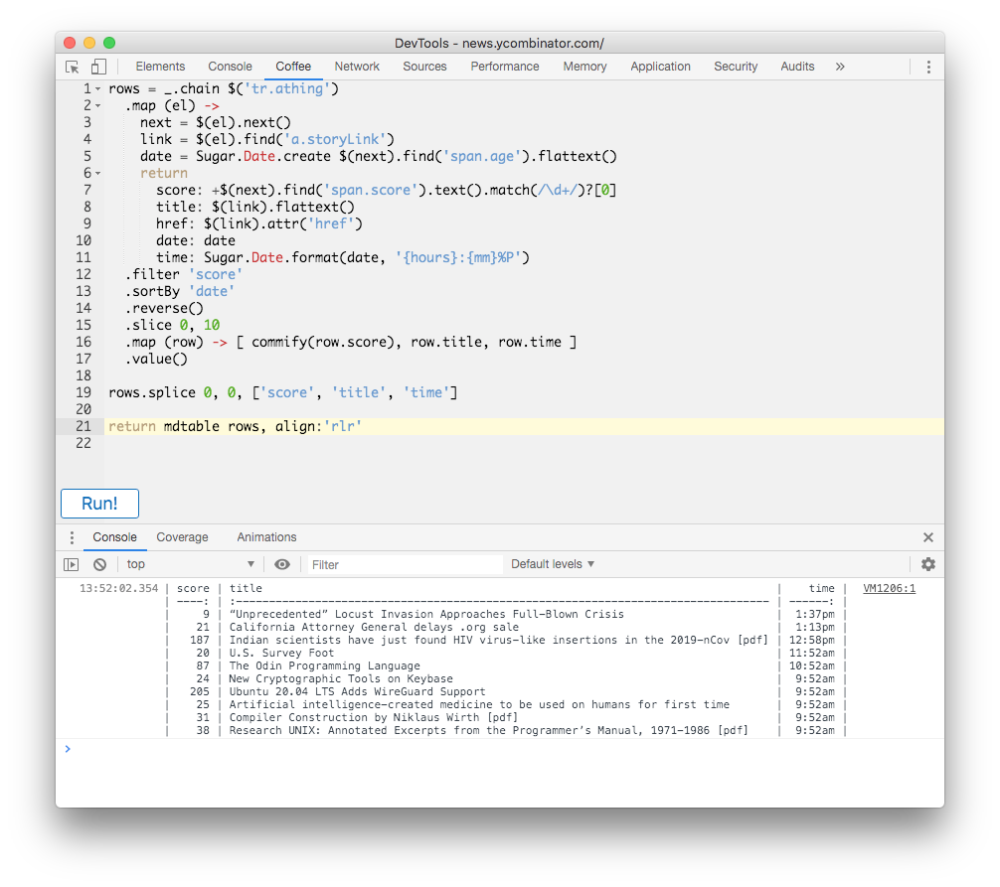

# CoffeeScript Console 3

A Chrome/Firefox extension to allow writing of
[CoffeeScript](http://coffeescript.org/) within the Web Inspector and run it
within the context of the current window, just like the built-in console.

## Installation

### Chrome

Enable `Developer mode` via the toggle in the upper-right corner at
`chrome://extensions/`, and load the unpacked extension from the `src`
directory from disk.

### Firefox

Enable `Temporary Add-ons` at `about:debugging#/runtime/this-firefox`, and
load the `src/manifest.json` file from disk.

## Features

  * Write [CoffeeScript](https://coffeescript.org) in [ACE editor](http://ace.ajax.org/):
    - Vim keybindings (in Chrome)
    - Syntax highlighting
    - Follows the devtools theme for dark mode
    - Command+Enter or Shift+Enter to run the current script
  * Included libraries for convenience:
    - `$` for [jQuery](https://api.jquery.com/)
    - `_` for [lodash](https://lodash.com/docs/4.17.15)
    - `moment` for [moment](https://momentjs.com/docs/), including moment-timezone
    - `Sugar` for [Sugar.js](https://sugarjs.com/quickstart//)
    - `mdtable()` function adapted from [markdown-table](https://github.com/wooorm/markdown-table)
      with a few small additions
  * Helper functions from [custom-helpers.js](./src/custom-helpers.js):
    - `$.flattext()` added to jQuery to flatten whitespace
    - `branch()` and `nodes()` to help crawl around the DOM
    - `commify()` to place commas as thousands separators

## Example

### A table of the most recent HN posts

This uses jQuery to parse out pairs of `<tr>` elements into an array of
objects, which is then chained through lodash before being fed to `mdtable()`.
Sorting is done by date, which requires parsing humanized date strings with
sugar.js (ie, parsing "2 hours ago" to a sortable time value).

## Credits

Based on
[CoffeeScript Console 3](https://github.com/gkovacs/CoffeeScriptConsole),
[CoffeeConsole 2](https://github.com/colldo/CoffeeConsole2), and
[CoffeeConsole](https://github.com/snookca/CoffeeConsole)
